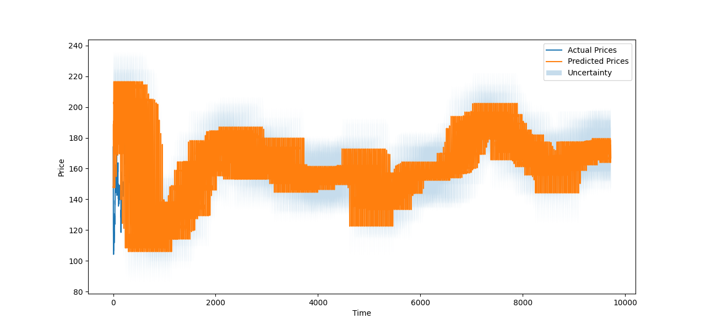

# ML-coin-prediction, a cryptocurrency prediction neural network by Alexander Nichols

## Tools used in the creation of this project:

> [CoinGeckoAPI](https://www.coingecko.com/en/api)

> PyTorch, sklearn, matplotlib

## Summary:

This is my coin prediction algorithm. This is the alpha stage, so there will be improvements to come. Soon to be implemented: accuracy improvements and better visuals

I use a Deep Feed-Forward Neural Network model (with a recurrent layer) with a resilient backpropagation optimizer that I train using cryptocurrency data starting from 2015; it trains over the trends of the price, volatility, and RSI, following it's own conceptual "fake" cryptocurrency running cocurrently. Then, the coin predicted history vs actual history and a prediction for tomorrows price is given.

Coins available: All coins available in the CoinGeckoAPI seen [here](https://www.coingecko.com/en/all-cryptocurrencies)

All files are necessary to run this

License can be found in the [License](LICENSE), and any and all suggestions should be emailed to _alexander.k.nichols@gmail.com_

Sample Image given example data batch (_29/04/23_):

